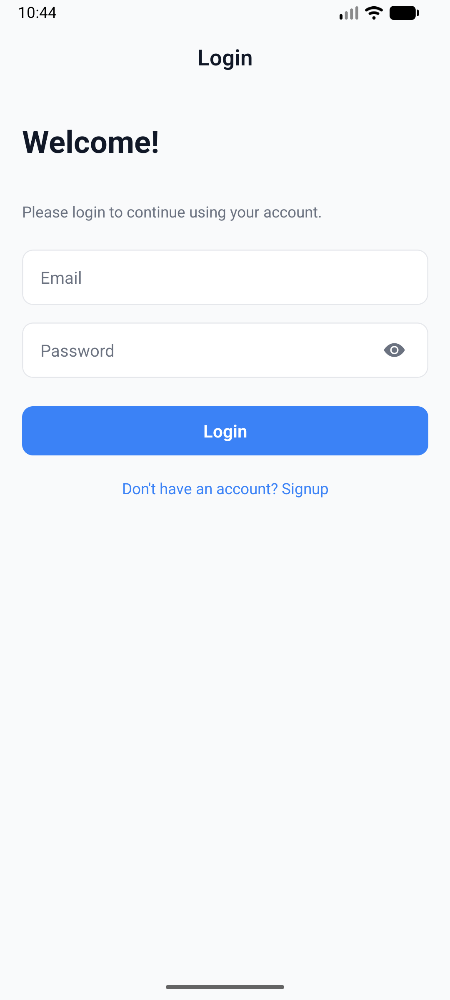
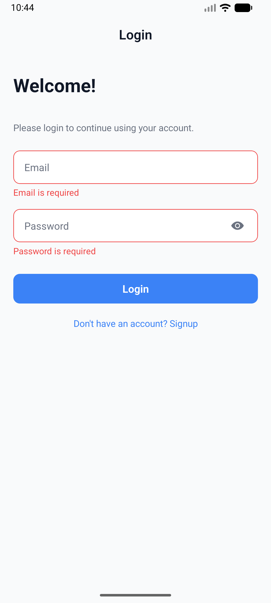
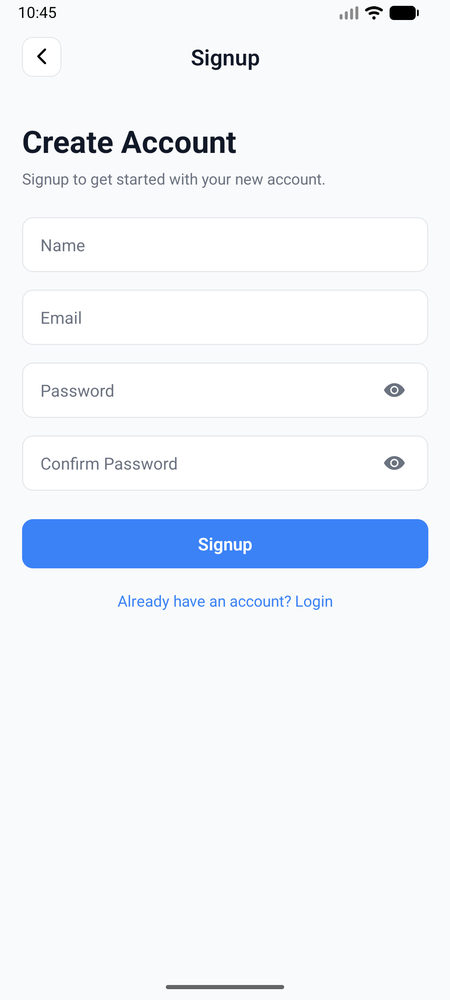
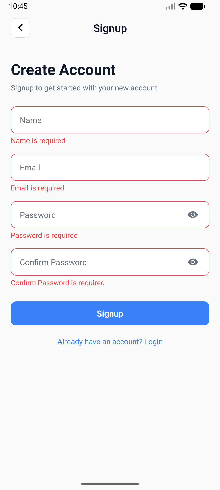
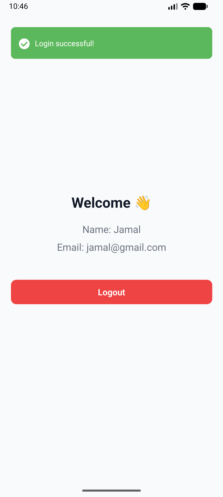

# 📱 React Native Authentication App

## 📌 Project Overview

This project is a React Native authentication application built using **React Native v0.83.2 (stable release)** with the **new architecture enabled** for better performance

### 🎯 Task Functionality

The application implements a complete authentication flow including:

- ✅ User Signup
- ✅ User Login
- ✅ Logout functionality
- ✅ Persistent session storage
- ✅ Form validation using schema-based validation
- ✅ Reusable UI components
- ✅ Navigation flow management
- ✅ Error handling & toast notifications

The goal of this project is to demonstrate:

- Proper state management using Context API
- Clean component architecture
- Secure local storage implementation
- Professional form validation handling
- Production-ready React Native structure

---

## 🛠 Tech Stack

- React Native (CLI)
- React Navigation
- React Hook Form
- Zod (Schema validation)
- MMKV (Secure local storage)
- React Native Flash Message
- Context API (State management)

## 📂 Folder Structure
```bash
project-root/
├── App.tsx
└── src/
    ├── apis/         # Simulated API calls or API service layer
    ├── components/   # Reusable UI components (Input, Button, Wrapper, etc.)
    ├── context/      # Authentication context (AuthContext)
    ├── navigation/   # App navigation setup (Navigators, types)
    ├── schemas/      # Zod validation schemas
    ├── screens/      # All app screens (Login, Signup, Home, etc.)
    ├── services/     # MMKV secure storage service
    ├── theme/        # Color themes
    ├── types/        # TypeScript types and interfaces
    └── utils/        # Helper functions
```

## 📸 Screenshots

### 🔐 Login Screen



### 📝 Signup Screen



### 🏠 Home Screen



This is a new [**React Native**](https://reactnative.dev) project, bootstrapped using [`@react-native-community/cli`](https://github.com/react-native-community/cli).

# Getting Started

> **Note**: Make sure you have completed the [Set Up Your Environment](https://reactnative.dev/docs/set-up-your-environment) guide before proceeding.

## Step 1: Start Metro

First, you will need to run **Metro**, the JavaScript build tool for React Native.

To start the Metro dev server, run the following command from the root of your React Native project:

```sh
# Using npm
npm start

# OR using Yarn
yarn start
```

## Step 2: Build and run your app

With Metro running, open a new terminal window/pane from the root of your React Native project, and use one of the following commands to build and run your Android or iOS app:

### Android

```sh
# Using npm
npm run android

# OR using Yarn
yarn android
```

### iOS

For iOS, remember to install CocoaPods dependencies (this only needs to be run on first clone or after updating native deps).

The first time you create a new project, run the Ruby bundler to install CocoaPods itself:

```sh
bundle install
```

Then, and every time you update your native dependencies, run:

```sh
bundle exec pod install
```

For more information, please visit [CocoaPods Getting Started guide](https://guides.cocoapods.org/using/getting-started.html).

```sh
# Using npm
npm run ios

# OR using Yarn
yarn ios
```

If everything is set up correctly, you should see your new app running in the Android Emulator, iOS Simulator, or your connected device.

This is one way to run your app — you can also build it directly from Android Studio or Xcode.

# Troubleshooting

If you're having issues getting the above steps to work, see the [Troubleshooting](https://reactnative.dev/docs/troubleshooting) page.

# Learn More

To learn more about React Native, take a look at the following resources:

- [React Native Website](https://reactnative.dev) - learn more about React Native.
- [Getting Started](https://reactnative.dev/docs/environment-setup) - an **overview** of React Native and how setup your environment.
- [Learn the Basics](https://reactnative.dev/docs/getting-started) - a **guided tour** of the React Native **basics**.
- [Blog](https://reactnative.dev/blog) - read the latest official React Native **Blog** posts.
- [`@facebook/react-native`](https://github.com/facebook/react-native) - the Open Source; GitHub **repository** for React Native.
